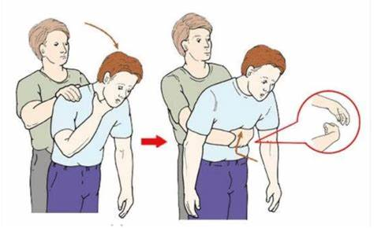
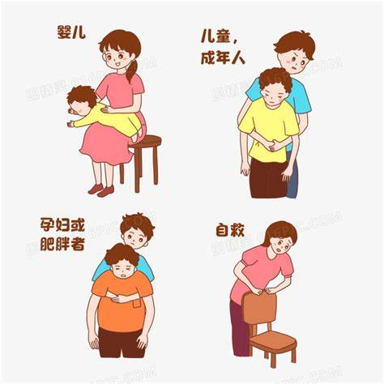

## 1. 怎样进行腹部冲击?

    答：站在患者身后，胳膊环绕患者腹部，双手互相握持并攥拳，快速向内向上冲击患者上腹部，连续做5次。这就是Heimlich手法。但这种方法不能用于1岁以下的儿童。

## 2. 我能用处理成人的方法对待儿童吗?

    答：可以。5次拍背结合5次腹部冲击能像对成人一样有效清理儿童的气道堵塞物。不要试图倒拎着孩子的脚来排出堵塞物。这样做不但无效，还可能摔伤儿童。

## 3. 婴儿窒息，应该怎么办?

    答：对小于1岁的婴儿，可以使其头低于胸部，托住头和颈，给予5次拍背和5次胸部冲击，注意冲击的部位在胸部正中低于乳头连线处。重复拍打和冲击，直到堵塞物出来或者能听到婴儿哭声。

